# Multi-User Plugin Lifecycle Management Architecture

## Executive Summary

This document outlines a comprehensive architectural solution for optimizing plugin lifecycle management in a multi-user environment. The current system suffers from resource inefficiency due to duplicate lifecycle manager instances, redundant plugin file storage, and lack of centralized coordination. The proposed solution introduces a centralized Plugin Lifecycle Service with logical reference-based storage that dramatically reduces memory usage, disk space consumption, and processing overhead while maintaining full user isolation, independent plugin versioning, and cross-platform compatibility.

## Current System Analysis

### Problems Identified

1. **Memory Overhead**: Each user's plugin maintains its own [`lifecycle_manager.py`](PluginBuild/NetworkReview/lifecycle_manager.py:1) instance, leading to multiple identical processes consuming system resources
2. **Disk Space Waste**: Plugin files are duplicated across user directories in [`backend/plugins/{user_id}/`](backend/plugins:1), creating unnecessary storage overhead
3. **Processing Redundancy**: Similar lifecycle operations (install, update, delete) are performed by multiple manager instances simultaneously
4. **Version Management Complexity**: No centralized mechanism to handle different plugin versions across users
5. **Resource Scaling Issues**: System resource consumption grows linearly with user count rather than plugin diversity

### Current Architecture Limitations


## Proposed Solution: Centralized Plugin Lifecycle Service

### Architecture Overview

The new architecture introduces a centralized service layer that manages plugin lifecycles efficiently while maintaining user isolation and independent versioning capabilities.

```mermaid
graph TB
    subgraph "Centralized Plugin Management Layer"
        PLS[Plugin Lifecycle Service<br/>- Unified API<br/>- Request Coordination<br/>- User State Management]
        PLR[Plugin Lifecycle Registry<br/>- Manager Instance Pool<br/>- Lazy Loading<br/>- Memory Management]
        PSM[Plugin Storage Manager<br/>- Shared File Storage<br/>- Logical References<br/>- Path Caching]
        PVM[Plugin Version Manager<br/>- Version Tracking<br/>- Dependency Resolution<br/>- Update Coordination]
    end

    subgraph "Optimized Storage Layer"
        PS[Plugin Store<br/>📁 shared/PluginName/v1.0.0/<br/>📁 shared/PluginName/v1.0.1/<br/>- Read-Only Assets<br/>- Version Isolation]
        UPS[User Plugin State<br/>📁 users/user_id/<br/>- User Configurations<br/>- Installation Metadata<br/>- Logical References]
        LMC[Lifecycle Manager Cache<br/>📁 lifecycle_managers/<br/>- Cached Instances<br/>- Shared Across Users]
    end

    subgraph "User Layer"
        U1[User 1<br/>Plugin A v1.0<br/>Plugin B v1.1]
        U2[User 2<br/>Plugin A v1.1<br/>Plugin C v1.0]
        UN[User N<br/>Plugin A v1.0<br/>Plugin D v2.0]
    end

    U1 --> PLS
    U2 --> PLS
    UN --> PLS

    PLS --> PLR
    PLS --> PSM
    PLS --> PVM

    PLR --> LMC
    PSM --> PS
    PSM --> UPS
    PVM --> PS

    style PLS fill:#ccffcc
    style PLR fill:#ccffcc
    style PSM fill:#ccffcc
    style PVM fill:#ccffcc
```



## Core Components

### 1. Plugin Lifecycle Service (PLS)

**Purpose**: Central orchestrator for all plugin lifecycle operations

**Key Responsibilities**:
- Provide unified API for plugin operations across all users
- Coordinate between registry, storage, and version management components
- Maintain user-specific plugin states and configurations
- Handle concurrent operations safely with proper locking mechanisms
- Provide audit logging and operation tracking

**Implementation Structure**:
```python
class PluginLifecycleService:
    def __init__(self):
        self.registry = PluginLifecycleRegistry()
        self.storage_manager = PluginStorageManager()
        self.version_manager = PluginVersionManager()
        self.operation_locks = {}  # Prevent concurrent operations
        self.audit_logger = AuditLogger()

    async def install_plugin(self, user_id: str, plugin_slug: str, version: str, source_url: str) -> Dict[str, Any]:
        """Install plugin for specific user with full coordination"""

    async def update_plugin(self, user_id: str, plugin_slug: str, new_version: str) -> Dict[str, Any]:
        """Update user's plugin to new version"""

    async def delete_plugin(self, user_id: str, plugin_slug: str) -> Dict[str, Any]:
        """Remove plugin for user while preserving shared resources"""

    async def get_plugin_status(self, user_id: str, plugin_slug: str) -> Dict[str, Any]:
        """Get comprehensive plugin status for user"""
```

### 2. Plugin Lifecycle Registry (PLR)

**Purpose**: Efficient management of lifecycle manager instances

**Key Features**:
- **Singleton Pattern**: One lifecycle manager instance per plugin type/version combination
- **Lazy Loading**: Instantiate managers only when first needed
- **Instance Pooling**: Reuse manager instances across multiple users
- **Memory Management**: Automatic cleanup of unused managers after configurable timeout
- **Usage Tracking**: Monitor active users per manager for optimal resource allocation

**Implementation Structure**:
```python
class PluginLifecycleRegistry:
    def __init__(self, cleanup_timeout: int = 300):  # 5 minutes default
        self._managers: Dict[str, BaseLifecycleManager] = {}
        self._usage_count: Dict[str, int] = {}
        self._last_used: Dict[str, datetime] = {}
        self._cleanup_timeout = cleanup_timeout
        self._cleanup_task = None

    async def get_manager(self, plugin_slug: str, version: str) -> BaseLifecycleManager:
        """Get or create lifecycle manager instance"""

    async def release_manager(self, plugin_slug: str, version: str, user_id: str):
        """Release manager reference and schedule cleanup if needed"""

    async def _cleanup_unused_managers(self):
        """Background task to clean up unused managers"""
```

### 3. Plugin Storage Manager (PSM)

**Purpose**: Optimize plugin file storage and access patterns

**Storage Strategy**:
- **Shared Plugin Store**: Store plugin files once per version in read-only shared location
- **User State Storage**: Maintain user-specific metadata with full shared paths for direct access
- **Logical References**: Use metadata-based references instead of filesystem links for cross-platform compatibility
- **Path Caching**: Store complete shared paths in user metadata to eliminate runtime resolution overhead
- **Atomic Operations**: Ensure storage operations are atomic to prevent corruption

**Directory Structure**:
```
plugins/
├── shared/                              # Shared plugin repository
│   ├── NetworkReview/
│   │   ├── v1.0.0/                     # Immutable version-specific files
│   │   │   ├── dist/
│   │   │   │   └── remoteEntry.js
│   │   │   ├── src/
│   │   │   │   └── ComponentNetworkReview.tsx
│   │   │   ├── package.json
│   │   │   ├── README.md
│   │   │   └── lifecycle_manager.py    # Version-specific lifecycle manager
│   │   ├── v1.0.1/
│   │   │   ├── dist/
│   │   │   ├── src/
│   │   │   ├── package.json
│   │   │   ├── README.md
│   │   │   └── lifecycle_manager.py
│   │   └── metadata.json               # Plugin-level metadata
│   ├── NetworkEyes/
│   │   ├── v1.0.0/
│   │   └── metadata.json
│   └── NetworkChatter/
│       ├── v1.0.0/
│       └── metadata.json
├── users/                              # User-specific data (no file links)
│   ├── user_1b6d596a10634e829cecf370cf0d33d0/
│   │   └── installed_plugins.json     # Plugin references with full shared paths
│   ├── user_9a242f695675464dbf64bfede388b1d2/
│   │   └── installed_plugins.json
│   └── user_36a89697c87b49038831e781fd50dbdc/
│       └── installed_plugins.json
└── cache/                              # Runtime cache
    ├── manager_instances/              # Cached lifecycle manager instances
    └── temp/                          # Temporary files during operations
```

**Implementation Structure**:
```python
class PluginStorageManager:
    def __init__(self, plugins_base_dir: Path):
        self.base_dir = plugins_base_dir
        self.shared_dir = self.base_dir / "shared"
        self.users_dir = self.base_dir / "users"
        self.cache_dir = self.base_dir / "cache"

    async def install_plugin_files(self, plugin_slug: str, version: str, source_path: Path) -> Path:
        """Install plugin files to shared storage if not already present, return shared path"""
        shared_plugin_path = self.shared_dir / plugin_slug / f"v{version}"

        if not shared_plugin_path.exists():
            # Copy plugin files to shared storage
            shared_plugin_path.mkdir(parents=True, exist_ok=True)
            await self._copy_plugin_files(source_path, shared_plugin_path)

        return shared_plugin_path

    async def register_user_plugin(self, user_id: str, plugin_slug: str, version: str, shared_path: Path, metadata: Dict[str, Any]) -> bool:
        """Register plugin installation for user with full shared path reference"""
        user_file = self.users_dir / f"user_{user_id}" / "installed_plugins.json"
        user_file.parent.mkdir(parents=True, exist_ok=True)

        # Load existing installations
        user_plugins = {}
        if user_file.exists():
            with open(user_file, 'r') as f:
                user_plugins = json.load(f)

        # Add new plugin reference
        user_plugins[plugin_slug] = {
            "version": version,
            "shared_path": str(shared_path.absolute()),
            "installed_at": datetime.now().isoformat(),
            "enabled": True,
            "user_config": metadata.get('user_config', {}),
            "installation_metadata": metadata.get('installation_metadata', {})
        }

        # Save updated references
        with open(user_file, 'w') as f:
            json.dump(user_plugins, f, indent=2)

        return True

    async def get_user_plugin_path(self, user_id: str, plugin_slug: str) -> Optional[Path]:
        """Get shared plugin path for user's installed plugin"""
        user_file = self.users_dir / f"user_{user_id}" / "installed_plugins.json"

        if not user_file.exists():
            return None

        with open(user_file, 'r') as f:
            user_plugins = json.load(f)

        if plugin_slug not in user_plugins:
            return None

        shared_path = Path(user_plugins[plugin_slug]["shared_path"])

        # Verify path still exists
        if not shared_path.exists():
            logger.warning(f"Shared plugin path no longer exists: {shared_path}")
            return None

        return shared_path

    async def get_user_plugin_metadata(self, user_id: str, plugin_slug: str) -> Dict[str, Any]:
        """Load user-specific plugin metadata and configuration"""
        user_file = self.users_dir / f"user_{user_id}" / "installed_plugins.json"

        if not user_file.exists():
            return {}

        with open(user_file, 'r') as f:
            user_plugins = json.load(f)

        return user_plugins.get(plugin_slug, {})

    async def unregister_user_plugin(self, user_id: str, plugin_slug: str) -> bool:
        """Remove plugin reference from user's installed plugins"""
        user_file = self.users_dir / f"user_{user_id}" / "installed_plugins.json"

        if not user_file.exists():
            return False

        with open(user_file, 'r') as f:
            user_plugins = json.load(f)

        if plugin_slug in user_plugins:
            del user_plugins[plugin_slug]

            with open(user_file, 'w') as f:
                json.dump(user_plugins, f, indent=2)

            return True

        return False

    async def get_all_user_plugins(self, user_id: str) -> Dict[str, Dict[str, Any]]:
        """Get all plugins installed for a user"""
        user_file = self.users_dir / f"user_{user_id}" / "installed_plugins.json"

        if not user_file.exists():
            return {}

        with open(user_file, 'r') as f:
            return json.load(f)

    async def cleanup_unused_versions(self) -> List[str]:
        """Remove plugin versions no longer used by any user"""
        # Scan all user plugin files to find referenced versions
        referenced_paths = set()

        for user_dir in self.users_dir.iterdir():
            if user_dir.is_dir():
                user_file = user_dir / "installed_plugins.json"
                if user_file.exists():
                    with open(user_file, 'r') as f:
                        user_plugins = json.load(f)

                    for plugin_data in user_plugins.values():
                        referenced_paths.add(plugin_data["shared_path"])

        # Find and remove unreferenced plugin versions
        removed_versions = []
        for plugin_dir in self.shared_dir.iterdir():
            if plugin_dir.is_dir():
                for version_dir in plugin_dir.iterdir():
                    if version_dir.is_dir() and str(version_dir.absolute()) not in referenced_paths:
                        shutil.rmtree(version_dir)
                        removed_versions.append(f"{plugin_dir.name}/{version_dir.name}")

        return removed_versions
```

### 4. Plugin Version Manager (PVM)

**Purpose**: Handle multiple plugin versions and dependencies efficiently

**Key Features**:
- **Version Registry**: Maintain comprehensive registry of available plugin versions
- **Dependency Resolution**: Handle plugin dependencies and version conflicts
- **Update Coordination**: Manage version updates across users without conflicts
- **Cleanup Management**: Automatically remove unused plugin versions
- **Compatibility Checking**: Validate plugin compatibility before installation

**Implementation Structure**:
```python
class PluginVersionManager:
    def __init__(self):
        self.version_registry: Dict[str, List[str]] = {}
        self.dependency_graph: Dict[str, Dict[str, str]] = {}
        self.compatibility_matrix: Dict[str, Dict[str, bool]] = {}

    async def register_version(self, plugin_slug: str, version: str, metadata: Dict[str, Any]):
        """Register new plugin version in the system"""

    async def check_compatibility(self, plugin_slug: str, version: str, user_plugins: List[Dict]) -> bool:
        """Check if plugin version is compatible with user's existing plugins"""

    async def get_update_candidates(self, user_id: str) -> List[Dict[str, Any]]:
        """Get list of plugins that have available updates for user"""

    async def cleanup_unused_versions(self) -> List[str]:
        """Remove plugin versions that are no longer used by any user"""
```

## Enhanced Lifecycle Manager Base Class

### Optimized Base Implementation

```python
from abc import ABC, abstractmethod
from pathlib import Path
from typing import Dict, Any, Set
from sqlalchemy.ext.asyncio import AsyncSession
import structlog

logger = structlog.get_logger()

class BaseLifecycleManager(ABC):
    """Enhanced base class for plugin lifecycle managers"""

    def __init__(self, plugin_slug: str, version: str, shared_storage_path: Path):
        self.plugin_slug = plugin_slug
        self.version = version
        self.shared_path = shared_storage_path
        self.active_users: Set[str] = set()
        self.instance_id = f"{plugin_slug}_{version}"
        self.created_at = datetime.now()
        self.last_used = datetime.now()

    @abstractmethod
    async def get_plugin_metadata(self) -> Dict[str, Any]:
        """Return plugin metadata and configuration"""
        pass

    @abstractmethod
    async def get_module_metadata(self) -> List[Dict[str, Any]]:
        """Return module definitions for this plugin"""
        pass

    async def install_for_user(self, user_id: str, db: AsyncSession, shared_plugin_path: Path) -> Dict[str, Any]:
        """Install plugin for specific user using shared plugin path"""
        try:
            logger.info(f"Installing {self.plugin_slug} v{self.version} for user {user_id}")

            # Check if already installed for this user
            if user_id in self.active_users:
                return {'success': False, 'error': 'Plugin already installed for user'}

            # Perform user-specific installation using shared path
            result = await self._perform_user_installation(user_id, db, shared_plugin_path)

            if result['success']:
                self.active_users.add(user_id)
                self.last_used = datetime.now()

            return result

        except Exception as e:
            logger.error(f"Installation failed for {self.plugin_slug} v{self.version}, user {user_id}: {e}")
            return {'success': False, 'error': str(e)}

    async def uninstall_for_user(self, user_id: str, db: AsyncSession) -> Dict[str, Any]:
        """Uninstall plugin for specific user"""
        try:
            logger.info(f"Uninstalling {self.plugin_slug} v{self.version} for user {user_id}")

            if user_id not in self.active_users:
                return {'success': False, 'error': 'Plugin not installed for user'}

            # Perform user-specific cleanup
            result = await self._perform_user_uninstallation(user_id, db)

            if result['success']:
                self.active_users.discard(user_id)
                self.last_used = datetime.now()

            return result

        except Exception as e:
            logger.error(f"Uninstallation failed for {self.plugin_slug} v{self.version}, user {user_id}: {e}")
            return {'success': False, 'error': str(e)}

    async def update_for_user(self, user_id: str, db: AsyncSession, new_version_manager: 'BaseLifecycleManager') -> Dict[str, Any]:
        """Handle user migration to new plugin version"""
        try:
            # Export user data from current version
            user_data = await self._export_user_data(user_id, db)

            # Uninstall current version
            uninstall_result = await self.uninstall_for_user(user_id, db)
            if not uninstall_result['success']:
                return uninstall_result

            # Install new version
            install_result = await new_version_manager.install_for_user(user_id, db, user_data.get('shared_plugin_path'))
            if not install_result['success']:
                # Rollback - reinstall old version
                await self.install_for_user(user_id, db, user_data.get('shared_plugin_path'))
                return install_result

            # Import user data to new version
            await new_version_manager._import_user_data(user_id, db, user_data)

            return {'success': True, 'migrated_data': user_data}

        except Exception as e:
            logger.error(f"Update failed for {self.plugin_slug}, user {user_id}: {e}")
            return {'success': False, 'error': str(e)}

    def can_be_unloaded(self) -> bool:
        """Check if this manager instance can be safely unloaded"""
        return len(self.active_users) == 0

    def get_usage_stats(self) -> Dict[str, Any]:
        """Get usage statistics for this manager instance"""
        return {
            'plugin_slug': self.plugin_slug,
            'version': self.version,
            'active_users': len(self.active_users),
            'user_list': list(self.active_users),
            'created_at': self.created_at.isoformat(),
            'last_used': self.last_used.isoformat(),
            'uptime_seconds': (datetime.now() - self.created_at).total_seconds()
        }

    @abstractmethod
    async def _perform_user_installation(self, user_id: str, db: AsyncSession, shared_plugin_path: Path) -> Dict[str, Any]:
        """Plugin-specific installation logic using shared plugin path"""
        pass

    @abstractmethod
    async def _perform_user_uninstallation(self, user_id: str, db: AsyncSession) -> Dict[str, Any]:
        """Plugin-specific uninstallation logic"""
        pass

    async def _export_user_data(self, user_id: str, db: AsyncSession) -> Dict[str, Any]:
        """Export user-specific data for migration (override if needed)"""
        return {}

    async def _import_user_data(self, user_id: str, db: AsyncSession, user_data: Dict[str, Any]):
        """Import user-specific data after migration (override if needed)"""
        pass
```

## API Integration

### Updated Plugin Router

```python
from fastapi import APIRouter, HTTPException, Depends, BackgroundTasks
from sqlalchemy.ext.asyncio import AsyncSession
from ..core.database import get_db
from ..core.security import get_current_user
from ..models.user import User
from .lifecycle_service import PluginLifecycleService

router = APIRouter(prefix="/api/plugins", tags=["plugins"])
plugin_lifecycle_service = PluginLifecycleService()

@router.post("/{plugin_slug}/install")
async def install_plugin(
    plugin_slug: str,
    version: str,
    source_url: str,
    background_tasks: BackgroundTasks,
    current_user: User = Depends(get_current_user),
    db: AsyncSession = Depends(get_db)
):
    """Install plugin for current user"""
    result = await plugin_lifecycle_service.install_plugin(
        user_id=current_user.id,
        plugin_slug=plugin_slug,
        version=version,
        source_url=source_url
    )

    if result['success']:
        # Schedule background cleanup of unused resources
        background_tasks.add_task(plugin_lifecycle_service.cleanup_unused_resources)

    return result

@router.put("/{plugin_slug}/update")
async def update_plugin(
    plugin_slug: str,
    new_version: str,
    background_tasks: BackgroundTasks,
    current_user: User = Depends(get_current_user),
    db: AsyncSession = Depends(get_db)
):
    """Update plugin to new version for current user"""
    result = await plugin_lifecycle_service.update_plugin(
        user_id=current_user.id,
        plugin_slug=plugin_slug,
        new_version=new_version
    )

    if result['success']:
        background_tasks.add_task(plugin_lifecycle_service.cleanup_unused_resources)

    return result

@router.delete("/{plugin_slug}")
async def delete_plugin(
    plugin_slug: str,
    background_tasks: BackgroundTasks,
    current_user: User = Depends(get_current_user),
    db: AsyncSession = Depends(get_db)
):
    """Delete plugin for current user"""
    result = await plugin_lifecycle_service.delete_plugin(
        user_id=current_user.id,
        plugin_slug=plugin_slug
    )

    if result['success']:
        background_tasks.add_task(plugin_lifecycle_service.cleanup_unused_resources)

    return result

@router.get("/{plugin_slug}/status")
async def get_plugin_status(
    plugin_slug: str,
    current_user: User = Depends(get_current_user),
    db: AsyncSession = Depends(get_db)
):
    """Get plugin status for current user"""
    return await plugin_lifecycle_service.get_plugin_status(
        user_id=current_user.id,
        plugin_slug=plugin_slug
    )

@router.get("/system/stats")
async def get_system_stats(
    current_user: User = Depends(get_current_user)
):
    """Get system-wide plugin statistics (admin only)"""
    if not current_user.is_admin:
        raise HTTPException(status_code=403, detail="Admin access required")

    return await plugin_lifecycle_service.get_system_stats()

@router.get("/public/plugins/{plugin_id}/{path:path}")
async def serve_plugin_files(
    plugin_id: str,
    path: str,
    current_user: User = Depends(get_current_user),
    db: AsyncSession = Depends(get_db)
):
    """Serve plugin files from shared storage for frontend access"""
    try:
        # Get user's plugin metadata to find shared path
        user_plugin_metadata = await plugin_lifecycle_service.storage_manager.get_user_plugin_metadata(
            current_user.id, plugin_id
        )

        if not user_plugin_metadata:
            raise HTTPException(status_code=404, detail="Plugin not installed for user")

        # Get the shared plugin path
        shared_path = Path(user_plugin_metadata["shared_path"])

        # Validate the shared path exists and is within allowed directory
        if not shared_path.exists() or not str(shared_path).startswith(str(plugin_lifecycle_service.storage_manager.shared_dir)):
            raise HTTPException(status_code=404, detail="Plugin files not found")

        # Construct the full file path
        file_path = shared_path / path

        # Security check: ensure the requested file is within the plugin directory
        if not str(file_path.resolve()).startswith(str(shared_path.resolve())):
            raise HTTPException(status_code=403, detail="Access denied")

        # Check if file exists
        if not file_path.exists() or not file_path.is_file():
            raise HTTPException(status_code=404, detail="File not found")

        # Return the file
        return FileResponse(
            path=str(file_path),
            media_type="application/javascript" if path.endswith('.js') else None
        )

    except HTTPException:
        raise
    except Exception as e:
        logger.error(f"Error serving plugin file {plugin_id}/{path}: {e}")
        raise HTTPException(status_code=500, detail="Internal server error")
```

## Background Services

### Cleanup Service

```python
import asyncio
from datetime import datetime, timedelta
from typing import List

class PluginCleanupService:
    def __init__(self, lifecycle_service: PluginLifecycleService):
        self.lifecycle_service = lifecycle_service
        self.cleanup_interval = 300  # 5 minutes
        self.manager_timeout = 1800  # 30 minutes
        self.version_retention_days = 30
        self._running = False

    async def start(self):
        """Start the cleanup service"""
        self._running = True
        while self._running:
            try:
                await self._cleanup_cycle()
                await asyncio.sleep(self.cleanup_interval)
            except Exception as e:
                logger.error(f"Cleanup cycle failed: {e}")
                await asyncio.sleep(60)  # Wait 1 minute before retry

    async def stop(self):
        """Stop the cleanup service"""
        self._running = False

    async def _cleanup_cycle(self):
        """Perform one cleanup cycle"""
        logger.info("Starting plugin cleanup cycle")

        # Clean up unused lifecycle managers
        cleaned_managers = await self._cleanup_unused_managers()

        # Clean up unused plugin versions
        cleaned_versions = await self._cleanup_unused_versions()

        # Clean up temporary files
        cleaned_temp_files = await self._cleanup_temp_files()

        logger.info(f"Cleanup completed: {cleaned_managers} managers, {cleaned_versions} versions, {cleaned_temp_files} temp files")

    async def _cleanup_unused_managers(self) -> int:
        """Clean up lifecycle managers that haven't been used recently"""
        registry = self.lifecycle_service.registry
        cleaned_count = 0

        cutoff_time = datetime.now() - timedelta(seconds=self.manager_timeout)

        for manager_key, manager in list(registry._managers.items()):
            if (manager.can_be_unloaded() and
                registry._last_used.get(manager_key, datetime.now()) < cutoff_time):

                await registry._unload_manager(manager_key)
                cleaned_count += 1

        return cleaned_count

    async def _cleanup_unused_versions(self) -> int:
        """Clean up plugin versions that are no longer used"""
        return await self.lifecycle_service.version_manager.cleanup_unused_versions()

    async def _cleanup_temp_files(self) -> int:
        """Clean up temporary files older than retention period"""
        temp_dir = self.lifecycle_service.storage_manager.cache_dir / "temp"
        cleaned_count = 0

        if temp_dir.exists():
            cutoff_time = datetime.now() - timedelta(days=1)

            for temp_file in temp_dir.iterdir():
                if temp_file.stat().st_mtime < cutoff_time.timestamp():
                    if temp_file.is_file():
                        temp_file.unlink()
                    elif temp_file.is_dir():
                        shutil.rmtree(temp_file)
                    cleaned_count += 1

        return cleaned_count
```

## Performance Benefits Analysis

### Resource Optimization Metrics

| Metric | Current System | Proposed System | Improvement |
|--------|----------------|-----------------|-------------|
| **Memory Usage** | N × M × L MB | M × V × L MB | ~N/V reduction |
| **Disk Space** | N × P × S MB | V × P × S MB | ~N/V reduction |
| **CPU Overhead** | N × O operations | V × O operations | ~N/V reduction |
| **Startup Time** | N × T seconds | V × T seconds | ~N/V reduction |

Where:
- N = Number of users
- M = Number of plugins per user
- V = Number of unique plugin versions
- L = Memory per lifecycle manager
- P = Number of plugins
- S = Size per plugin
- O = Operations per manager
- T = Time per manager initialization

### Example Scenario

**System with 1000 users, 5 plugins each, 2 versions per plugin:**

| Resource | Current | Proposed | Savings |
|----------|---------|----------|---------|
| Lifecycle Managers | 5,000 instances | 10 instances | 99.8% reduction |
| Memory Usage | ~5 GB | ~10 MB | 99.8% reduction |
| Disk Space | ~50 GB | ~1 GB | 98% reduction |
| Plugin Files | 25,000 copies | 50 copies | 99.8% reduction |

## Migration Strategy

### Phase 1: Foundation (Weeks 1-2)
**Objective**: Implement core infrastructure alongside existing system

**Tasks**:
1. Create [`PluginLifecycleService`](backend/app/plugins/lifecycle_service.py:1) class
2. Implement [`PluginLifecycleRegistry`](backend/app/plugins/lifecycle_registry.py:1) with manager pooling
3. Develop [`PluginStorageManager`](backend/app/plugins/storage_manager.py:1) with shared storage
4. Create [`PluginVersionManager`](backend/app/plugins/version_manager.py:1) for version tracking
5. Implement [`BaseLifecycleManager`](backend/app/plugins/base_lifecycle_manager.py:1) enhanced base class

**Deliverables**:
- Core service classes implemented
- Unit tests for all components
- Integration tests for service coordination
- Documentation for new architecture

### Phase 2: Storage Migration (Weeks 3-4)
**Objective**: Migrate to optimized storage structure with backward compatibility

**Tasks**:
1. Create new directory structure in [`backend/plugins/`](backend/plugins:1)
2. Implement migration script to move existing plugins to shared storage
3. Create user metadata files with logical references to shared plugins
4. Update storage access patterns in existing code
5. Implement rollback mechanism for migration failures

**Deliverables**:
- Migration scripts tested and validated
- Backward compatibility maintained
- Storage optimization verified
- Performance benchmarks collected

### Phase 3: Lifecycle Manager Updates (Weeks 5-6)
**Objective**: Update existing lifecycle managers to use new base class

**Tasks**:
1. Refactor [`NetworkReview/lifecycle_manager.py`](PluginBuild/NetworkReview/lifecycle_manager.py:1) to extend [`BaseLifecycleManager`](backend/app/plugins/base_lifecycle_manager.py:1)
2. Update [`NetworkChatter/lifecycle_manager.py`](PluginBuild/NetworkChatter/lifecycle_manager.py:1) and [`NetworkEyes/lifecycle_manager.py`](PluginBuild/NetworkEyes/lifecycle_manager.py:1)
3. Implement manager instance pooling and reuse
4. Add user migration support for version updates
5. Test manager lifecycle with multiple concurrent users

**Deliverables**:
- All lifecycle managers updated
- Manager pooling operational
- Concurrent user testing completed
- Memory usage optimization verified

### Phase 4: API Integration (Weeks 7-8)
**Objective**: Switch API endpoints to use new centralized service

**Tasks**:
1. Update [`backend/app/routers/plugins.py`](backend/app/routers/plugins.py:1) to use [`PluginLifecycleService`](backend/app/plugins/lifecycle_service.py:1)
2. Implement new endpoints for system statistics and monitoring
3. Add background cleanup service integration
4. Update frontend services to work with new API responses
5. Implement comprehensive error handling and logging

**Deliverables**:
- API endpoints fully migrated
- Frontend integration completed
- Background services operational
- Monitoring and logging enhanced

### Phase 5: Cleanup and Optimization (Weeks 9-10)
**Objective**: Remove old system and optimize performance

**Tasks**:
1. Remove old plugin management code
2. Clean up deprecated database fields and tables
3. Optimize database queries for new architecture
4. Implement advanced caching strategies
5. Performance tuning and load testing

**Deliverables**:
- Legacy code removed
- Database optimized
- Performance targets met
- System ready for production

### Migration Risk Mitigation

**Rollback Strategy**:
- Maintain parallel systems during migration
- Implement feature flags for gradual rollout
- Create automated rollback scripts
- Maintain data backups at each phase

**Testing Strategy**:
- Comprehensive unit and integration tests
- Load testing with realistic user scenarios
- Canary deployments for validation
- User acceptance testing with beta users

**Monitoring Strategy**:
- Real-time performance monitoring
- Resource usage tracking
- Error rate monitoring
- User experience metrics

## Monitoring and Observability

### Key Metrics to Track

**Resource Utilization**:
- Memory usage per lifecycle manager instance
- Disk space utilization in shared vs user directories
- CPU usage during plugin operations
- Network I/O for plugin downloads and updates

**Performance Metrics**:
- Plugin installation/update/deletion times
- Manager instance creation and cleanup times
- Database query performance for plugin operations
- Cache hit rates for manager instances

**System Health**:
- Number of active lifecycle manager instances
- Plugin version distribution across users
- Failed operation rates and error patterns
- Background cleanup service effectiveness

### Monitoring Implementation

```python
from prometheus_client import Counter, Histogram, Gauge, CollectorRegistry
import structlog

# Metrics collection
PLUGIN_OPERATIONS = Counter('plugin_operations_total', 'Total plugin operations', ['operation', 'plugin_slug', 'status'])
OPERATION_DURATION = Histogram('plugin_operation_duration_seconds', 'Plugin operation duration', ['operation', 'plugin_slug'])
ACTIVE_MANAGERS = Gauge('active_lifecycle_managers', 'Number of active lifecycle manager instances')
MEMORY_USAGE = Gauge('plugin_memory_usage_bytes', 'Memory usage by plugin system')

class PluginMetrics:
    def __init__(self):
        self.logger = structlog.get_logger()

    def record_operation(self, operation: str, plugin_slug: str, duration: float, success: bool):
        """Record plugin operation metrics"""
        status = 'success' if success else 'failure'
        PLUGIN_OPERATIONS.labels(operation=operation, plugin_slug=plugin_slug, status=status).inc()
        OPERATION_DURATION.labels(operation=operation, plugin_slug=plugin_slug).observe(duration)

    def update_system_metrics(self, active_managers: int, memory_usage: int):
        """Update system-wide metrics"""
        ACTIVE_MANAGERS.set(active_managers)
        MEMORY_USAGE.set(memory_usage)
```

## Security Considerations

### User Isolation
- Validate all shared plugin paths to prevent directory traversal attacks
- Ensure user metadata files cannot reference paths outside the shared plugin directory
- Validate all user inputs for plugin operations
- Implement proper access controls for shared plugin files

## Frontend Compatibility Layer

### Maintaining Frontend Access to Plugin Files

The new logical reference system requires a backend compatibility layer to ensure existing frontend services like [`remotePluginService.ts`](frontend/src/services/remotePluginService.ts:1) continue to work without modification.

**Key Requirements**:
- Frontend must access plugin files via URLs like `/api/v1/public/plugins/{plugin_id}/dist/remoteEntry.js`
- Backend must resolve user-specific plugin references to shared file locations
- Security must prevent users from accessing plugins they haven't installed
- File serving must be efficient and support all plugin file types

**Implementation Strategy**:

### 1. Plugin File Serving Endpoint

The new `/api/v1/public/plugins/{plugin_id}/{path:path}` endpoint provides seamless access to plugin files:

```python
@router.get("/public/plugins/{plugin_id}/{path:path}")
async def serve_plugin_files(
    plugin_id: str,
    path: str,
    current_user: User = Depends(get_current_user),
    db: AsyncSession = Depends(get_db)
):
    """Serve plugin files from shared storage for frontend access"""
    # 1. Validate user has plugin installed
    # 2. Resolve plugin_id to shared storage path
    # 3. Serve file with security checks
    # 4. Return appropriate content-type headers
```

### 2. URL Resolution Process

**Frontend Request Flow**:


### 3. Security Considerations

**Access Control**:
- Users can only access files for plugins they have installed
- Path traversal attacks prevented by validating file paths
- All file access restricted to shared plugin directories
- User authentication required for all plugin file requests

**Path Validation**:
```python
# Security checks in the file serving endpoint
def validate_plugin_file_access(user_id: str, plugin_id: str, file_path: str) -> bool:
    # 1. Check user has plugin installed
    user_metadata = get_user_plugin_metadata(user_id, plugin_id)
    if not user_metadata:
        return False

    # 2. Validate shared path exists and is within allowed directory
    shared_path = Path(user_metadata["shared_path"])
    if not shared_path.exists():
        return False

    # 3. Ensure requested file is within plugin directory
    full_file_path = shared_path / file_path
    if not str(full_file_path.resolve()).startswith(str(shared_path.resolve())):
        return False

    return True
```

### 4. Frontend Compatibility

**No Frontend Changes Required**:
- Existing [`remotePluginService.ts`](frontend/src/services/remotePluginService.ts:94) `getFullUrl()` method continues to work
- Plugin manifest API returns same structure with `bundlelocation` paths
- File URLs resolve to shared storage transparently
- All existing plugin loading logic remains unchanged

**URL Construction Example**:
```typescript
// Frontend continues to work as before
const pluginUrl = `${baseApiUrl}/api/v1/public/plugins/${effectiveId}/${cleanUrl}`;
// Example: https://api.example.com/api/v1/public/plugins/NetworkReview/dist/remoteEntry.js

// Backend resolves this to shared storage:
// /plugins/shared/NetworkReview/v1.0.0/dist/remoteEntry.js
```

### 5. Performance Optimizations

**Caching Strategy**:
- Plugin file serving includes appropriate cache headers
- Shared files served efficiently without duplication
- User metadata cached to avoid repeated database queries
- File existence checks optimized with caching

**Content Delivery**:
```python
@router.get("/public/plugins/{plugin_id}/{path:path}")
async def serve_plugin_files(...):
    # Set appropriate cache headers for static assets
    headers = {
        "Cache-Control": "public, max-age=3600",  # 1 hour cache
        "ETag": f'"{plugin_id}-{path}-{file_mtime}"'
    }

    return FileResponse(
        path=str(file_path),
        headers=headers,
        media_type=get_media_type(path)
    )
```

### 6. Migration Compatibility

**Backward Compatibility During Migration**:
- Old file serving endpoints remain active during transition
- Gradual migration of users to new storage structure
- Fallback mechanisms for plugins not yet migrated
- Monitoring to ensure no frontend disruption

**Migration Process**:
1. Deploy new plugin file serving endpoint alongside existing system
2. Migrate plugins to shared storage while maintaining old paths
3. Update user metadata to reference shared storage
4. Verify frontend continues to access files correctly
5. Remove old file serving logic after validation

This compatibility layer ensures that the frontend [`remotePluginService.ts`](frontend/src/services/remotePluginService.ts:1) and all existing plugin loading mechanisms continue to work seamlessly while benefiting from the optimized backend storage architecture.