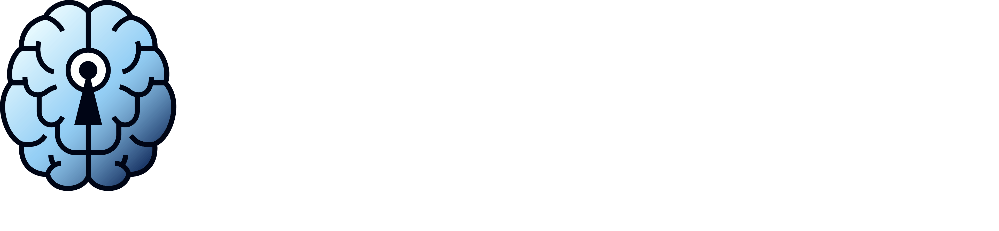

# BrainDrive

**BrainDrive is your personal AI system—fully owned, endlessly extensible, and built for freedom.**  
It’s an open-source platform for building and running AI-powered applications using a modular plugin system and a responsive drag-and-drop interface.

With BrainDrive, you can:
- 🧠 Create your own AI assistants, workflows, and tools
- 🔌 Extend functionality using plugins or build your own
- 🖥️ Host locally or deploy anywhere—with no lock-ins
- 🤝 Own your data, your AI, and the value you create

> Your AI. Your Rules.

🚀 Ready to get started? [Check out the setup guide ](INSTALL.md)

🎥 Want to see BrainDrive in action? [Watch the video](https://youtu.be/3G_OibAo-_o)


 

## Overview

BrainDrive consists of three main components:

- **Frontend**: A React-based application that provides a visual editor for arranging and configuring plugins
- **Backend**: A Python API server that handles data storage, user management, and plugin services
- **Plugins**: Modular components that extend the platform's functionality

The platform is designed to be:

- **Modular**: Build applications by combining reusable plugins
- **Extensible**: Create custom plugins to add new features
- **Responsive**: Design applications that work across desktop, tablet, and mobile devices
- **User-friendly**: Intuitive drag-and-drop interface for non-technical users
- **Developer-friendly**: Comprehensive APIs and tools for plugin developers

## Key Features

- **Plugin Studio**: Visual editor for creating applications by arranging plugins
- **Plugin Management**: Browse, install, and configure plugins
- **Responsive Design**: Support for desktop, tablet, and mobile layouts
- **User Management**: Authentication, authorization, and user-specific data
- **Theme Support**: Light and dark mode with customizable themes
- **Page Management**: Create and organize multiple pages
- **Route Management**: Define navigation between pages
- **Component Configuration**: Configure plugin properties through a user-friendly interface
- **Service Architecture**: Modular service-based architecture for extensibility

## Architecture

BrainDrive follows a modular architecture:

```
BrainDrive/
├── frontend/       # React-based UI application
├── backend/        # Python API server
└── plugins/        # Plugin system and examples
```

### Frontend

The frontend is built with React, TypeScript, and Material UI. It provides:

- Visual editor for arranging plugins
- Plugin management interface
- User authentication and settings
- Theme management
- Page and route configuration

[Learn more about the frontend](frontend/README.md)

### Backend

The backend is built with Python and provides:

- RESTful API for data access
- User authentication and authorization
- Plugin data storage and retrieval
- User settings and preferences
- Database management

### Plugin System

The plugin system allows developers to extend the platform with:

- UI Components
- Settings Components
- Service Components
- Integration Components

[Learn more about the plugin system](plugins/README.md)

## Getting Started

### Prerequisites

- Node.js 16.x or higher
- Python 3.9 or higher (Python 3.11 recommended)
- Git
- Conda or Python's venv module for environment management

### Installation and Setup

For detailed installation and setup instructions, please refer to:

- [Installation Guide](INSTALL.md) - Complete instructions how to setup your BrainDrive

After following the setup guides, you can:

1. Start the backend server (from the backend directory)
2. Start the frontend development server (from the frontend directory)
3. Open your browser and navigate to http://localhost:5173

### System Guides

- [Backend Setup Guide](backend/README.md) - Complete instructions for setting up the Python backend, including environment configuration, database setup, and running the server
- [Plugin Setup Guide](plugins/README.md) - Instructions for building and using the plugin system
- [Frontend Setup Guide](frontend/README.md) - Instructions for setting up the React frontend


### Project Structure

- `frontend/`: Frontend application
  - `src/`: Source code
    - `components/`: Reusable UI components
    - `contexts/`: React context providers
    - `features/`: Feature-specific code
    - `hooks/`: Custom React hooks
    - `pages/`: Page components
    - `services/`: Service layer for API communication

- `backend/`: Backend server
  - `app/`: Application code
    - `api/`: API endpoints
    - `core/`: Core functionality
    - `models/`: Database models
    - `schemas/`: Data validation schemas

- `plugins/`: Plugin system and examples
  - `BrainDriveBasicAIChat/`: Example AI chat plugin
  - `BrainDriveSettings/`: Example settings plugin

## Contributing

We welcome contributions to BrainDrive! Please see our [Contributing Guidelines](CONTRIBUTING.md) for more information.

### Development Guidelines

- Use TypeScript for frontend code
- Follow PEP 8 for Python code
- Write tests for new features
- Document your code with comments
- Update documentation when making changes

## License

This project is licensed under the [MIT License](LICENSE).

## Documentation

- [Frontend Documentation](frontend/README.md)
- [Plugin System Documentation](plugins/README.md)
- [Backend Documentation](backend/README.md)

## Support

For support, please open an issue on GitHub or contact the maintainers.
