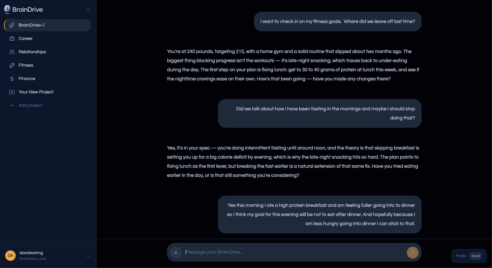
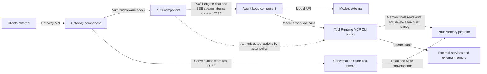

# BrainDrive

[](LICENSE)

BrainDrive is a personal AI system that helps you define, set, and reach your goals. Self-hosted and MIT licensed.



<p align="center">
  <a href="https://braindrive.ai">Website</a> · <a href="https://community.braindrive.ai">Community</a>
</p>

## What Is BrainDrive?

BrainDrive is a personal AI system that partners with you to improve your career, relationships, fitness, finances — whatever matters to you. It interviews you to understand your goals, builds a structured spec and action plan, then works with you over time to follow through. Every conversation builds Your Memory, so the more you use it, the better it knows you.

Other AI tools chat. BrainDrive partners with you to get things done.

- **For everyone** — designed so anyone can start benefiting from AI, not just developers
- **Compounding** — your AI gets smarter with every interaction, and that value belongs to you
- **Private** — Your Memory lives on your machine, not in someone else's cloud

## What You Get

- **A structured path to your goals** — interview → spec → action plan → ongoing partnership
- **Life areas built in** — Career, Relationships, Fitness, Finance, plus create your own projects
- **Your data stays yours** — conversations, memory, and files live on your machine
- **Any AI model** — cloud models via API, local models via Ollama, or both
- **One install** — runs in Docker on Linux, macOS, and WSL
- **MIT licensed** — fork it, extend it, make it yours

## Quick Start

Prerequisites: [Docker Desktop](https://www.docker.com/products/docker-desktop/) (or Docker Engine + Compose on Linux).

Quickstart uses published Docker images (no local source build required).

macOS/Linux:
```bash
curl -fsSL https://raw.githubusercontent.com/BrainDriveAI/BrainDrive/main/installer/bootstrap/install.sh | bash
```

Windows PowerShell:
```powershell
irm https://raw.githubusercontent.com/BrainDriveAI/BrainDrive/main/installer/bootstrap/install.ps1 | iex
```

Open [http://127.0.0.1:8080](http://127.0.0.1:8080), create your account, and start talking to your BrainDrive.

Quick update:

macOS/Linux:
```bash
curl -fsSL https://raw.githubusercontent.com/BrainDriveAI/BrainDrive/main/installer/bootstrap/update.sh | bash
```

Windows PowerShell:
```powershell
irm https://raw.githubusercontent.com/BrainDriveAI/BrainDrive/main/installer/bootstrap/update.ps1 | iex
```

## How It Works

1. **Land on BrainDrive+1** — your primary AI assistant. It knows everything across all your projects and helps you get started.
2. **Explore life areas** — Career, Relationships, Fitness, Finance are ready to go. Create new projects for anything else.
3. **Interview** — your AI asks the right questions to understand your situation, goals, and what success looks like.
4. **Spec** — it organizes what it learned into a clear, structured document — your goals, context, and success criteria.
5. **Plan** — the spec becomes an action plan with concrete steps, phases, and milestones.
6. **Partner** — come back anytime. Your AI remembers everything and helps you stay on track, adjust plans, and make progress.

## Architecture

BrainDrive implements the [Personal AI Architecture](https://github.com/BrainDriveAI/personal-ai-architecture) (PAA) — an open spec for user-owned AI systems. Every component is swappable. Your Memory is the foundation; everything else can be replaced.


```mermaid
flowchart LR
    C[Clients external] -->|Gateway API| G[Gateway component]
    G -->|Auth middleware check| A[Auth component]
    A -->|POST engine chat and SSE stream internal contract D137| E[Agent Loop component]
    E -->|Model API| M[Models external]

    G -->|Conversation store tool D152| CST[Conversation Store Tool internal]
    CST -->|Read and write conversations| YM[Your Memory platform]

    E -->|Model-driven tool calls| TR[Tool Runtime MCP CLI Native]
    TR -->|Memory tools read write edit delete search list history| YM
    TR -->|External tools| EX[External services and external memory]

    A -.->|Authorizes tool actions by actor policy| TR
```

The system runs as two Docker containers: an app server (Gateway + tools) and an edge proxy (web client + Caddy). Your Memory is stored as plain files in a Docker volume — fully portable, fully yours.

## Lifecycle Commands

| Command | What it does |
|---------|-------------|
| `./installer/docker/scripts/install.sh quickstart` | First-time quickstart setup — pulls images and starts everything |
| `./installer/docker/scripts/start.sh quickstart` | Start quickstart after stopping |
| `./installer/docker/scripts/stop.sh quickstart` | Stop quickstart without removing data |
| `./installer/docker/scripts/upgrade.sh quickstart` | Upgrade quickstart to latest published images |
| `./installer/docker/scripts/backup.sh` | Back up Your Memory and secrets |
| `./installer/docker/scripts/restore.sh memory <file> quickstart` | Restore from backup (quickstart stack) |

See [`installer/docker/README.md`](installer/docker/README.md) for production deployment, Windows equivalents, and advanced operations.

## Project Structure

```
braindrive/
├── builds/typescript/       # Core: gateway, engine, auth, memory, web client
├── builds/mcp_release/      # MCP tool services
├── installer/docker/        # Docker compose, Dockerfiles, Caddy config
├── installer/docker/scripts/ # Canonical lifecycle and release scripts
└── docs/                    # Documentation
```

## Built With

- [Personal AI Architecture](https://github.com/BrainDriveAI/personal-ai-architecture) — the open foundation spec
- TypeScript, Fastify, React, Tailwind CSS
- Docker and Caddy for deployment
- [MCP](https://modelcontextprotocol.io/) for tool integration

## Contributing

We welcome contributions. See [CONTRIBUTING.md](CONTRIBUTING.md) for how to get started, or join the discussion at [community.braindrive.ai](https://community.braindrive.ai).

## License

MIT — see [LICENSE](LICENSE).
