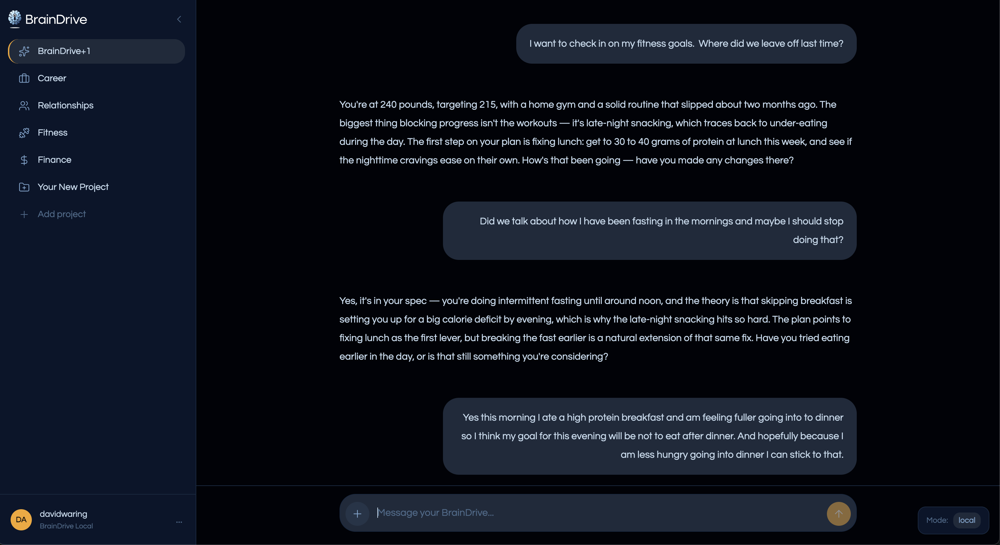
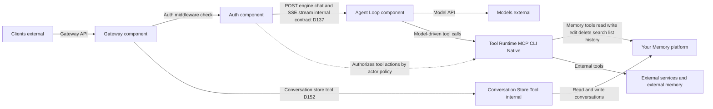

# BrainDrive

[](LICENSE) [](https://community.braindrive.ai)

> [!NOTE]
> **BrainDrive is currently in beta.** We ship improvements near-daily — check the
> [releases page](https://github.com/BrainDriveAI/BrainDrive/releases) for the version
> you're running and what's changed. If something breaks or feels off, tell us in
> [Issues](https://github.com/BrainDriveAI/BrainDrive/issues) or on the
> [community forum](https://community.braindrive.ai).

BrainDrive is a personal AI system that helps you define, set, and reach your goals. Self-hosted and MIT licensed.



<p align="center">
  <a href="https://braindrive.ai">Website</a> · <a href="https://www.braindrive.ai/install">Install</a> · <a href="https://community.braindrive.ai">Community</a> · <a href="ROADMAP.md">Roadmap</a>
</p>

## What Is BrainDrive?

BrainDrive is a personal AI system that partners with you to improve your career, relationships, fitness, finances — whatever matters to you. It interviews you to understand your goals, builds a structured spec and action plan, then works with you over time to follow through. Every conversation builds Your Memory, so the more you use it, the better it knows you.

Other AI tools chat. BrainDrive partners with you to get things done.

- **For everyone** — designed so anyone can start benefiting from AI, not just developers
- **Compounding** — your AI gets smarter with every interaction, and that value belongs to you
- **Private** — Your Memory lives on your machine, not in someone else's cloud

## What You Get

- **A structured path to your goals** — interview → spec → action plan → ongoing partnership
- **Life areas built in** — Career, Relationships, Fitness, Finance, plus create your own projects
- **Your data stays yours** — conversations, memory, and files live on your machine
- **Memory backup modes** — push memory snapshots to your own Git repo (manual or scheduled)
- **Move it with you** — export and import your BrainDrive between machines or supported install types
- **Flexible AI models** — BrainDrive Models with credits, OpenRouter with your API key, or local models through Ollama
- **Install your way** — native desktop on Apple silicon Macs and x64 Windows, or Docker on macOS, Windows, Linux, and WSL
- **Use it from your other devices** — connect over your home Wi-Fi or a private Tailscale network with BrainDrive Desktop
- **MIT licensed** — fork it, extend it, make it yours

## Quick Start

Choose the installation that fits how you want to run BrainDrive:

| Option | Supported platforms | Requirements | Best for |
|--------|---------------------|--------------|----------|
| **BrainDrive Desktop** | macOS (Apple silicon), Windows (x64) | No Docker required | Most people; includes Browser Access and Tailscale Remote Access controls |
| **Docker local** | macOS, Windows, Linux, WSL | Docker Desktop, or Docker Engine + Compose on Linux | Browser-based local use and self-hosting |

### BrainDrive Desktop

Download the current installer from the [BrainDrive install page](https://www.braindrive.ai/install) or the [GitHub Releases page](https://github.com/BrainDriveAI/BrainDrive/releases). The desktop installer includes the BrainDrive runtime; Docker is not required.

Install the app, open BrainDrive, create your local owner account, and start talking to Your Agent.

### Docker Local

Prerequisite: [Docker Desktop](https://www.docker.com/products/docker-desktop/) on macOS or Windows, or Docker Engine + Compose on Linux.

Docker local uses published images, so no local source build is required.
Replace `<release-tag>` with a published date tag from the [Releases page](https://github.com/BrainDriveAI/BrainDrive/releases); do not use `main`.

macOS/Linux:

```bash
curl -fsSL https://raw.githubusercontent.com/BrainDriveAI/BrainDrive/<release-tag>/installer/bootstrap/install.sh | bash
```

Windows PowerShell:

```powershell
irm https://raw.githubusercontent.com/BrainDriveAI/BrainDrive/<release-tag>/installer/bootstrap/install.ps1 | iex
```

Open [http://127.0.0.1:8080](http://127.0.0.1:8080), create your account, and start talking to your BrainDrive.

Quick update:

macOS/Linux:

```bash
curl -fsSL https://raw.githubusercontent.com/BrainDriveAI/BrainDrive/<release-tag>/installer/bootstrap/update.sh | bash
```

Windows PowerShell:

```powershell
irm https://raw.githubusercontent.com/BrainDriveAI/BrainDrive/<release-tag>/installer/bootstrap/update.ps1 | iex
```

## How It Works

1. **Land on Your Agent** — your primary AI assistant. It knows everything across all your projects and helps you get started.
2. **Explore life areas** — Career, Relationships, Fitness, Finance are ready to go. Create new projects for anything else.
3. **Interview** — your AI asks the right questions to understand your situation, goals, and what success looks like.
4. **Spec** — it organizes what it learned into a clear, structured document — your goals, context, and success criteria.
5. **Plan** — the spec becomes an action plan with concrete steps, phases, and milestones.
6. **Partner** — come back anytime. Your AI remembers everything and helps you stay on track, adjust plans, and make progress.

## For Developers

BrainDrive is built on the [Personal AI Architecture](https://github.com/Personal-AI-Architecture/the-architecture) (PAA) — an open, MIT-licensed standard for user-owned AI systems. Think of PAA as the spec and BrainDrive as the implementation. Anyone can build on the architecture; BrainDrive is our take on it.

| I want to... | Start here |
|--------------|------------|
| **Understand the architecture** | [Personal AI Architecture](https://github.com/Personal-AI-Architecture/the-architecture) — foundation spec, component contracts, conformance tests, zero lock-in by design |
| **Build with AI assistance** | [Architecture Primer](https://github.com/Personal-AI-Architecture/the-architecture/tree/main/docs/ai) — token-optimized reference files designed to hand directly to your AI agent. Compliance matrix, component primers, audit playbooks, canonical examples. |
| **Hack on BrainDrive** | [CONTRIBUTING.md](CONTRIBUTING.md) — fork, build, run tests, submit a PR |
| **Run the hot-reload stack** | [Docker developer mode](#docker-modes-and-lifecycle-commands) — build from source with backend watching and Vite hot module replacement |

## Architecture


```mermaid
flowchart LR
    C[Clients external] -->|Gateway API| G[Gateway component]
    G -->|Auth middleware check| A[Auth component]
    A -->|POST engine chat and SSE stream internal contract D137| E[Agent Loop component]
    E -->|Model API| M[Models external]

    G -->|Conversation store tool D152| CST[Conversation Store Tool internal]
    CST -->|Read and write conversations| YM[Your Memory platform]

    E -->|Model-driven tool calls| TR[Tool Runtime MCP CLI Native]
    TR -->|Memory tools read write edit delete search list history| YM
    TR -->|External tools| EX[External services and external memory]

    A -.->|Authorizes tool actions by actor policy| TR
```

BrainDrive Desktop packages the web client and local runtime into a native app. The Docker deployment runs as two containers: an app server (Gateway + tools) and an edge proxy (web client + Caddy). In both local installation paths, Your Memory stays on your hardware.

## Docker Modes and Lifecycle Commands

- **Local** — pulls published images and runs the browser-based app at `http://127.0.0.1:8080`
- **Developer** — builds from source and runs the backend watcher plus Vite hot reload at `http://127.0.0.1:5073`
- **Production** — runs a self-hosted public HTTPS deployment on infrastructure and a domain you control

| Command | What it does |
|---------|-------------|
| `./installer/docker/scripts/install.sh local` | First-time local setup — pulls prebuilt images and starts everything |
| `./installer/docker/scripts/install.sh dev` | Developer setup — builds from source and starts hot-reload stack |
| `./installer/docker/scripts/install.sh prod` | Production setup for a self-hosted public HTTPS deployment |
| `./installer/docker/scripts/start.sh local` | Start local stack after stopping |
| `./installer/docker/scripts/stop.sh local` | Stop local stack without removing data |
| `./installer/docker/scripts/upgrade.sh local` | Upgrade local stack to latest published images |
| `./installer/docker/scripts/backup.sh` | Back up Your Memory and secrets |
| `./installer/docker/scripts/support-bundle.sh local 24h` | Create a redacted support bundle archive for sharing with support |
| `./installer/docker/scripts/restore.sh memory <file> local` | Restore from backup (local stack) |

See [`installer/docker/README.md`](installer/docker/README.md) for production deployment, Windows equivalents, and advanced operations.

## Backup and Restore

Local BrainDrive installations include a **Backup** settings tab for saving memory snapshots to your own HTTPS Git repository.

What it supports:

1. Configure repository URL, token, and frequency in **Settings -> Backup**
2. Run an immediate backup with **Back Up Now**
3. Run scheduled backups in `after_changes`, `hourly`, or `daily` modes
4. Restore memory from backup branch snapshots

Important safety behavior:

1. Restore is **memory-only**. Secrets are not restored from git backup.
2. Backup repository URL must be `https://` (SSH URLs are rejected).
3. Token is stored as a vault secret reference, not plaintext preferences.

Setup and validation instructions:

1. Operator notes: [`installer/docker/README.md`](installer/docker/README.md)
2. Step-by-step local test flow: [`docs/onboarding/getting-started-testing-openrouter-docker.md`](docs/onboarding/getting-started-testing-openrouter-docker.md)

## Move BrainDrive to Another Machine

Open **Settings -> Migrate** to download a complete migration archive or import one created by another BrainDrive installation. Use migration when moving to a new computer or changing between supported install types.

Migration archives include Your Memory and configured local secrets when available. Treat an exported archive like a password and store or transfer it securely. Git memory backups are different: they restore memory only and do not contain secrets.

## Access BrainDrive From Other Devices

BrainDrive Desktop on Windows and macOS includes two ways to use your local BrainDrive from another device:

| Feature | Use it for | Requirements |
|---------|------------|--------------|
| **Browser Access** | Open BrainDrive from a phone, tablet, or computer on the same home Wi-Fi; the app provides a local address and QR code | BrainDrive Desktop running on the host |
| **Remote Access** | Connect from your own trusted devices away from home through a private HTTPS Tailscale address | BrainDrive Desktop running on the host and Tailscale installed on each device |

Both paths show the normal BrainDrive sign-in experience, and neither creates a public BrainDrive link. See the [Tailscale Remote Access guide](docs/tailscale-remote-access.md) for supported systems, setup, security boundaries, troubleshooting, and safe disable instructions.

## Operator Quick Usage

Support bundle script:

- Linux/macOS/WSL:
  - `./installer/docker/scripts/support-bundle.sh local 24h`
- Windows PowerShell:
  - `.\installer\docker\scripts\support-bundle.ps1 -Mode local -SinceWindow 24h`

Gateway support-bundle API (local JWT auth mode only):

- `POST /api/support/bundles` creates a memory-local support bundle archive.
- `GET /api/support/bundles` lists generated support bundle archives.
- `GET /api/support/bundles/:fileName` downloads a specific archive.

## Project Structure

```
braindrive/
├── builds/typescript/       # Core: gateway, engine, auth, memory, web client
├── builds/typescript/src-tauri/ # Desktop shell and native installer configuration
├── builds/mcp_release/      # MCP tool services
├── installer/docker/        # Docker compose, Dockerfiles, Caddy config
├── installer/docker/scripts/ # Canonical lifecycle and release scripts
└── docs/                    # Documentation
```

The packages use `"private": true` intentionally: they are MIT-licensed application components distributed with BrainDrive, not packages published to npm.

## Built With

- [Personal AI Architecture](https://github.com/Personal-AI-Architecture/the-architecture) — the open foundation spec
- TypeScript, Fastify, React, Tailwind CSS
- Tauri for the Windows and macOS desktop apps
- Docker and Caddy for deployment
- [MCP](https://modelcontextprotocol.io/) for tool integration

## Contributing

We welcome contributions. See [CONTRIBUTING.md](CONTRIBUTING.md) for how to get started, or join the discussion at [community.braindrive.ai](https://community.braindrive.ai).

## License

MIT — see [LICENSE](LICENSE).
