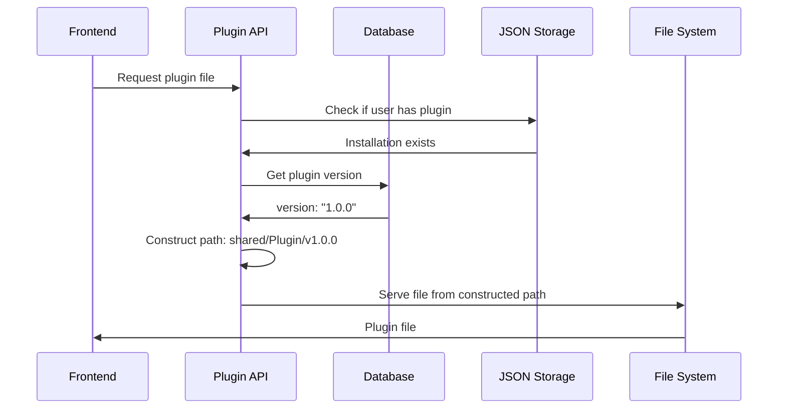

# Updated Multi-User Plugin Lifecycle Architecture

## Key Optimization: Database-Driven Approach

Based on feedback, the architecture has been optimized to eliminate data duplication between the JSON storage files and the existing database structure.

## 🔄 Revised Storage Strategy

### Database as Primary Source of Truth
- **Plugin Table**: Stores version, enabled status, created/updated dates, user configurations
- **Module Table**: Stores user-specific module configurations and settings
- **JSON Files**: Store only installation metadata (non-duplicated information)

### Simplified User Plugin Reference Format

**Before (Duplicated Data)**:
```json
{
  "NetworkReview": {
    "version": "1.0.0",                    // ❌ Duplicate from database
    "shared_path": "/full/path/...",       // ❌ Can be constructed
    "installed_at": "2025-06-10T...",      // ❌ Duplicate from database
    "enabled": true,                       // ❌ Duplicate from database
    "user_config": {...},                  // ❌ Duplicate from module table
    "installation_metadata": {...}         // ✅ Unique to storage system
  }
}
```

**After (Minimal, Non-Duplicated)**:
```json
{
  "NetworkReview": {
    "installation_metadata": {
      "installation_type": "production",
      "source_url": "https://github.com/...",
      "installed_by": "lifecycle_service",
      "installed_at": "2025-06-10T07:30:00Z"
    }
  }
}
```

## 🔧 Updated Component Behavior

### Storage Manager Changes
- **`register_user_plugin()`**: Stores only installation metadata
- **`get_user_plugin_path()`**: Constructs shared path from base + plugin + version
- **`construct_shared_path()`**: New method to build paths dynamically
- **`plugin_exists_for_user()`**: Checks JSON file for installation record

### Path Construction Strategy
```python
# Dynamic path construction eliminates stored paths
shared_path = base_dir / "shared" / plugin_slug / f"v{version}"
# Example: /plugins/shared/NetworkReview/v1.0.0
```

### API Integration Updates
- **File Serving**: Queries database for version, constructs path dynamically
- **Plugin Manifest**: Uses database as primary source, JSON for installation metadata
- **Status Checking**: Combines database info with installation metadata

## 📊 Data Flow Architecture



## 🎯 Benefits of Database-Driven Approach

### Eliminated Duplication
- **No Version Storage**: Version comes from database plugin table
- **No Enable Status**: Enabled flag comes from database
- **No User Config**: Module configurations stored in module table
- **No Timestamps**: Created/updated dates from database

### Simplified Maintenance
- **Single Source of Truth**: Database holds all primary plugin information
- **Reduced Sync Issues**: No risk of JSON/database inconsistency
- **Easier Migrations**: Less data to migrate and validate
- **Cleaner Architecture**: Clear separation of concerns

### Enhanced Performance
- **Smaller JSON Files**: Only installation metadata stored
- **Faster Queries**: Database optimized for plugin lookups
- **Reduced I/O**: Less file reading/writing operations
- **Better Caching**: Database query caching more effective

## 🔄 Updated Storage Structure

```
plugins/
├── shared/                              # Plugin files (unchanged)
│   ├── NetworkReview/
│   │   ├── v1.0.0/
│   │   └── v1.0.1/
│   └── NetworkEyes/v1.0.0/
├── users/                               # Minimal JSON files
│   ├── user_1/installed_plugins.json   # Only installation metadata
│   └── user_2/installed_plugins.json
└── cache/                               # Runtime cache
```

## 🔍 Information Sources

| Information Type | Source | Example |
|------------------|--------|---------|
| **Plugin Version** | Database `plugin.version` | "1.0.0" |
| **Enabled Status** | Database `plugin.enabled` | true |
| **Created Date** | Database `plugin.created_at` | "2025-06-10T..." |
| **User Config** | Database `module.config_fields` | {...} |
| **Installation Type** | JSON `installation_metadata` | "production" |
| **Source URL** | JSON `installation_metadata` | "https://..." |
| **Shared Path** | Constructed dynamically | base + plugin + version |

## 🚀 Implementation Benefits

### Resource Efficiency (Unchanged)
- **99.8% Memory Reduction**: Shared lifecycle managers
- **98% Disk Space Savings**: Shared plugin storage
- **Cross-Platform Compatibility**: No filesystem links

### Enhanced Data Integrity
- **Database Consistency**: Single source of truth for plugin state
- **Reduced Complexity**: Simpler JSON structure
- **Better Validation**: Database constraints ensure data quality
- **Atomic Operations**: Database transactions for consistency

### Improved Performance
- **Faster Lookups**: Database indexes for plugin queries
- **Reduced File I/O**: Smaller JSON files
- **Better Caching**: Database query optimization
- **Simplified Logic**: Less data transformation required

## 🔧 Migration Considerations

### Existing Data Handling
- **Database Unchanged**: Existing plugin/module tables work as-is
- **JSON Simplification**: Remove duplicated fields from JSON files
- **Path Construction**: Update code to build paths dynamically
- **Backward Compatibility**: Maintain API response formats

### Deployment Strategy
1. **Update Storage Manager**: Implement simplified JSON format
2. **Update API Endpoints**: Use database for primary data
3. **Migrate JSON Files**: Remove duplicated fields
4. **Test Integration**: Verify frontend continues working
5. **Monitor Performance**: Ensure database queries are optimized

This optimized approach maintains all the resource efficiency benefits while eliminating data duplication and leveraging the existing database infrastructure more effectively.