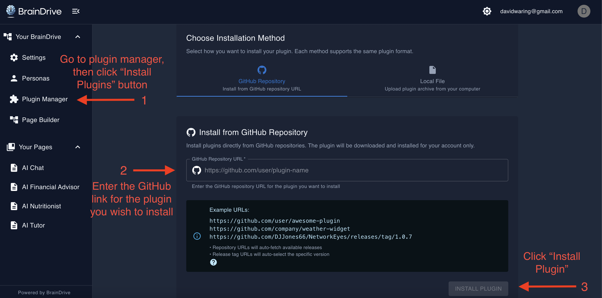
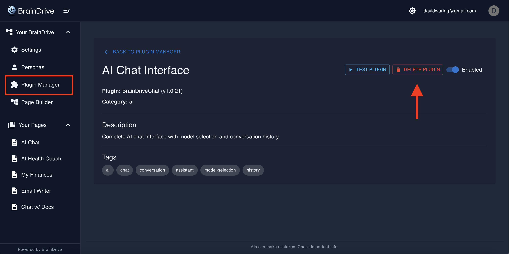

# How BrainDrive Plugins Work

This document provides a comprehensive overview of the BrainDrive plugin system. It's designed to help you understand how plugins integrate with BrainDrive, whether you're using an existing plugin or building your own.

## What is a BrainDrive Plugin?

A BrainDrive plugin is a self-contained module that extends BrainDrive's functionality. Plugins can add:

- New UI components for the Page Builder
- AI-powered features and capabilities
- Backend services and data processing
- Integration with external systems
- Custom workflows and automation

The plugin architecture follows a philosophy similar to WordPress for AI: install the BrainDrive core, then add plugins to quickly ship new features.

## Plugin Architecture Overview

BrainDrive uses a modular, plugin-based architecture with two main parts:

### Frontend (UI Components)

- Built with **React 18** and **TypeScript**
- Uses **Webpack Module Federation** to load plugins dynamically at runtime
- Plugins expose UI components that can be dragged onto pages in the Page Builder
- Components are loaded on-demand without requiring a full application reload

### Backend (Server-Side Logic)

- Uses **Python** with **FastAPI**
- Plugins can include optional server-side logic via a **Lifecycle Manager**
- Backend handles plugin installation, configuration, and data persistence
- Provides universal REST API endpoints for plugin management

## Plugin Structure

A typical BrainDrive plugin repository has the following structure:

```
MyPlugin/
├── package.json              # Metadata and dependencies
├── src/                      # Source code (React components)
│   ├── index.tsx            # Main entry point
│   └── components/          # Plugin components
├── dist/                     # Built files
│   └── remoteEntry.js       # Module Federation entry point
├── lifecycle_manager.py      # (Optional) Backend lifecycle manager
├── webpack.config.js         # Build configuration
└── README.md                # Plugin documentation
```

### Key Files

**package.json**
- Defines plugin metadata (name, version, description)
- Lists frontend dependencies
- Includes build scripts

**lifecycle_manager.py** (Optional)
- Python class implementing plugin lifecycle methods
- Handles installation, removal, and status checks
- Must end with `LifecycleManager` (e.g., `MyPluginLifecycleManager`)
- Defines what components the plugin provides

**remoteEntry.js**
- Generated by Webpack Module Federation during build
- Exposes plugin modules to the BrainDrive core
- Automatically served by the backend when plugin is installed

## Plugin Lifecycle

### Installation

When a user installs a plugin through the Plugin Manager:

1. **User provides GitHub URL** - The plugin repository URL is entered in the Plugin Manager UI
2. **Backend downloads plugin** - BrainDrive clones or downloads the plugin repository
3. **Lifecycle manager runs** - If present, the plugin's `install_plugin(user_id, db)` method is called
4. **Setup tasks execute** - The plugin can initialize databases, create default settings, etc.
5. **Plugin registered** - The plugin is added to the user's installed plugins list
6. **Frontend updated** - Plugin components become available in the Page Builder



### Usage

Once installed:

- Plugin components appear in the **Page Builder component library**
- Users can drag components onto pages and configure them
- Components use **Service Bridges** to interact with BrainDrive
- Plugin state and data persist across sessions

[Adding Plugin to Page](../../images/adding-plugin-template-to-page.png)

### Updates

- BrainDrive tracks plugin versions from the repository
- Users can update plugins through the Plugin Manager
- Updates are user-scoped (each user controls their plugin versions)
- Update process follows similar steps to installation

### Removal

When a plugin is uninstalled:

1. **User clicks uninstall** in the Plugin Manager
2. **Lifecycle manager runs** - The `delete_plugin(user_id, db)` method is called
3. **Cleanup occurs** - Plugin removes its data, settings, and files
4. **Plugin unregistered** - Removed from user's installed plugins
5. **Components removed** - No longer available in Page Builder



## Universal Plugin API

BrainDrive provides a standardized REST API for all plugins. These endpoints work automatically for any plugin following the lifecycle interface:

```
POST   /api/plugins/{plugin_slug}/install     # Install plugin
DELETE /api/plugins/{plugin_slug}/uninstall   # Uninstall plugin
GET    /api/plugins/{plugin_slug}/status      # Check if installed
GET    /api/plugins/{plugin_slug}/info        # Get metadata
POST   /api/plugins/{plugin_slug}/repair      # Repair/reinstall
GET    /api/plugins/available                 # List all plugins
```

This universal API means plugin developers don't need to create custom endpoints for basic plugin management.

## Service Bridges

BrainDrive provides six core [service bridges](https://docs.braindrive.ai/core/how-to/use-service-bridges) that plugins use to interact with the system. These services are available via `this.props.services` in React components:

### 1. API Bridge
Make HTTP requests to backend APIs
```typescript
await services.api.get('/some_endpoint')
await services.api.post('/data', { key: 'value' })
```

### 2. Event Bridge
Send and listen for cross-plugin events
```typescript
services.event.emit('eventName', data)
services.event.on('eventName', handler)
```

### 3. Theme Bridge
Access and react to theme changes
```typescript
const theme = services.theme.getCurrentTheme()
services.theme.subscribe(newTheme => {
  // React to theme change
})
```

### 4. Settings Bridge
Get and set user preferences
```typescript
const value = await services.settings.getSetting('myKey')
await services.settings.setSetting('myKey', 'value')
```

### 5. Page Context Bridge
Access current page and route information
```typescript
const context = services.pageContext.getContext()
// Returns: { currentPage, route, params, etc. }
```

### 6. Plugin State Bridge
Persistent key-value storage for your plugin
```typescript
await services.pluginState.save({ myData: 'value' })
const data = await services.pluginState.load()
```

### Why Service Bridges?

Service Bridges provide several benefits:

- **Loose coupling** - Plugins don't depend on core internals
- **Forward compatibility** - Core changes won't break plugins
- **Simplified development** - No need to manage your own database or API
- **Consistent patterns** - All plugins interact with BrainDrive the same way

## Plugin Discovery

BrainDrive automatically discovers plugins in the `backend/plugins/` directory:

```
backend/plugins/
├── shared/           # Plugin files shared across users
│   └── MyPlugin/
│       └── v1.0.0/
│           ├── dist/
│           └── lifecycle_manager.py
└── user_{id}/        # User-specific plugin data
    └── MyPlugin/
        └── data/
```

Plugins are:
- **User-scoped** - Each user has their own set of installed plugins
- **Version-tracked** - Multiple versions can coexist
- **Sandboxed** - User data is isolated from the shared plugin code

## Development Workflow

### Setting Up

1. **Use the Plugin Template** - Start with the official [BrainDrive Plugin Template](https://github.com/BrainDriveAI/BrainDrive-PluginTemplate)
2. **Clone locally** - Clone the template to begin development
3. **Install dependencies** - Run `npm install` to get started
4. **Configure output** - Point build output to BrainDrive's plugin directory

### Rapid Iteration

For fast development (1-minute cycle):

1. **Configure build output** - Set webpack output to `backend/plugins/shared/[YourPlugin]/[version]/dist`
2. **Make changes** - Edit your plugin code
3. **Build** - Run `npm run build`
4. **Refresh** - Reload BrainDrive in browser (disable cache in dev tools)
5. **See changes** - Updates appear immediately without reinstalling

This eliminates the 10+ minute cycle of uninstalling and reinstalling the plugin after each change.

### Testing

- Use the **Page Builder** to add your plugin component to a test page
- Use browser dev tools to debug React components
- Check backend console for lifecycle manager logs
- Use Service Bridges for consistent interaction patterns

## Plugin Manifest

Each plugin defines metadata in its lifecycle manager that tells BrainDrive what the plugin provides:

```python
class MyPluginLifecycleManager:
    def get_plugin_info(self):
        return {
            "name": "My Plugin",
            "slug": "my-plugin",
            "version": "1.0.0",
            "description": "Does something useful",
            "components": [
                {
                    "id": "my-component",
                    "name": "My Component",
                    "category": "widgets"
                }
            ]
        }
```

This information drives:
- Plugin Manager UI
- Page Builder component library
- Component configuration panels
- Plugin documentation

## Multi-User Support

BrainDrive is designed to support multiple users on the same installation:

- **User-scoped installations** - Each user has their own plugin list
- **Shared code** - Plugin code is shared, but data is isolated
- **Independent updates** - Users update plugins independently
- **Permission-based** - Users only see and manage their own plugins

## Best Practices

### For Plugin Developers

1. **Follow the template** - Use the official Plugin Template as your starting point
2. **Use Service Bridges** - Don't bypass them to access core internals
3. **Keep plugins focused** - Each plugin should do one thing well
4. **Document thoroughly** - Include clear README with usage examples
5. **Version properly** - Use semantic versioning and maintain changelog
6. **Test in isolation** - Ensure plugin works independently of others
7. **Handle errors gracefully** - Provide helpful error messages to users

### For Plugin Users

1. **Install from trusted sources** - Only install plugins from known repositories
2. **Keep plugins updated** - Update regularly for bug fixes and features
3. **Monitor performance** - Remove plugins that slow down your system
4. **Report issues** - Help developers improve by reporting bugs
5. **Share feedback** - Let developers know what works and what doesn't

## Security Considerations

- Plugins run with the same permissions as the BrainDrive core
- Only install plugins from sources you trust
- Review plugin code before installing if possible
- Plugin lifecycle managers have database access
- Plugins can make network requests
- BrainDrive provides sandboxing for user data, not plugin code

## Common Patterns

### Creating a Simple Widget

```typescript
import React from 'react';

const MyWidget = ({ services }) => {
  const [data, setData] = React.useState(null);

  React.useEffect(() => {
    // Load plugin state
    services.pluginState.load().then(setData);
  }, []);

  return (
    <div>
      <h2>My Widget</h2>
      <p>{data?.message || 'Hello, World!'}</p>
    </div>
  );
};

export default MyWidget;
```

### Calling an AI Model

```typescript
const response = await services.api.post('/api/chat/completions', {
  messages: [{ role: 'user', content: 'Hello!' }],
  model: 'default'
});
```

### Saving User Settings

```typescript
// Save a setting
await services.settings.setSetting('myPlugin.preference', 'dark');

// Load a setting
const pref = await services.settings.getSetting('myPlugin.preference');
```

### Cross-Plugin Communication

```typescript
// Plugin A emits an event
services.event.emit('dataUpdated', { newValue: 42 });

// Plugin B listens for the event
services.event.on('dataUpdated', (data) => {
  console.log('Data changed:', data.newValue);
});
```

## Troubleshooting

### Plugin Won't Install

- Verify the GitHub URL is correct and accessible
- Check that the repository has a proper build/release
- Look at backend console for error messages during install
- Ensure the plugin structure follows the expected format

### Components Don't Appear

- Verify the plugin is installed (check Plugin Manager)
- Ensure the plugin is enabled for your user
- Check that `remoteEntry.js` exists in the plugin's dist folder
- Look for browser console errors indicating loading issues

### Changes Not Showing

- Disable browser cache in dev tools during development
- Verify both backend and frontend servers are running
- Check that build output is going to the correct directory
- Clear browser cache and hard refresh (Ctrl+Shift+R)

### Service Bridge Errors

- Verify you're accessing services via `this.props.services`
- Check that the service method exists and is spelled correctly
- Ensure you're awaiting async service calls
- Look for error messages in browser console

## Resources

- **[Plugin Template](https://github.com/BrainDriveAI/BrainDrive-PluginTemplate)**: Official starter template with examples
- **[BrainDrive Documentation](https://docs.braindrive.ai)**: Comprehensive guides and references
- **[Community Forum](community.braindrive.ai)**: Get help and share ideas
- **GitHub Issues**: Report bugs and request features
- **[Example Plugins](https://docs.braindrive.ai/plugins/intro)**: Reference implementations for common patterns

## Getting Help

If you need assistance with plugin development or usage:

1. **Check the documentation** - Most questions are answered in the official docs
2. **Search the forum** - Someone may have already solved your problem
3. **Ask the community** - Post on community.braindrive.ai
4. **Open an issue** - For bugs, open a GitHub issue on the relevant repository
5. **Review examples** - Study existing plugins to see how they work

## Contributing

BrainDrive is open source and welcomes contributions:

- **Report bugs** - Help improve quality by reporting issues
- **Suggest features** - Share ideas for new capabilities
- **Improve docs** - Help make documentation clearer
- **Build plugins** - Extend the ecosystem with new plugins
- **Share knowledge** - Help others on the forum

---

**Remember**: The plugin system is designed to be simple and powerful. When in doubt, refer to the Plugin Template and use the Service Bridges. The BrainDrive community is here to help you succeed!
